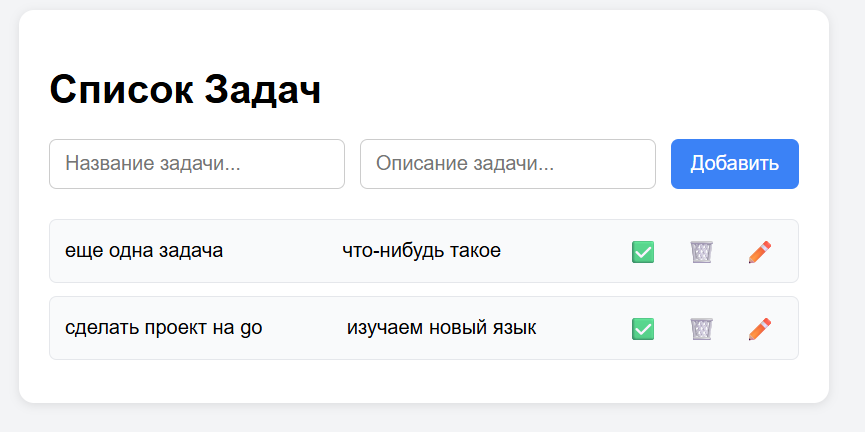
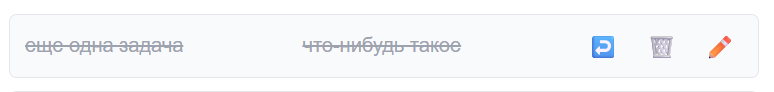
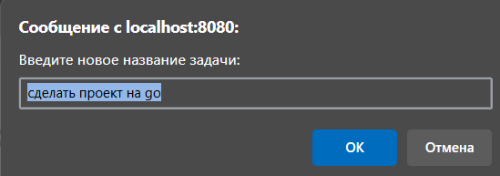
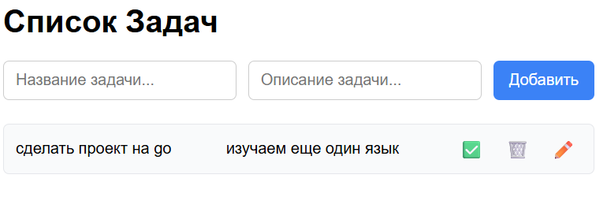

# ToDo App
Приложение представляет собой список задач и поддерживает следующий функционал:
* Создание задач
* Удаление задач
* Пометка задачи как выполненной и наоборот

Все задачи представлены на единственной странице приложения:

Задачи можно отмечать выполненными или наоборот. На рисунке сверху обе задачи не выполнены. Выполненные задачи имеют следующий вид:

При изменении задачи пользователю предлагают ввести новые название и описание:

Результат изменения:

